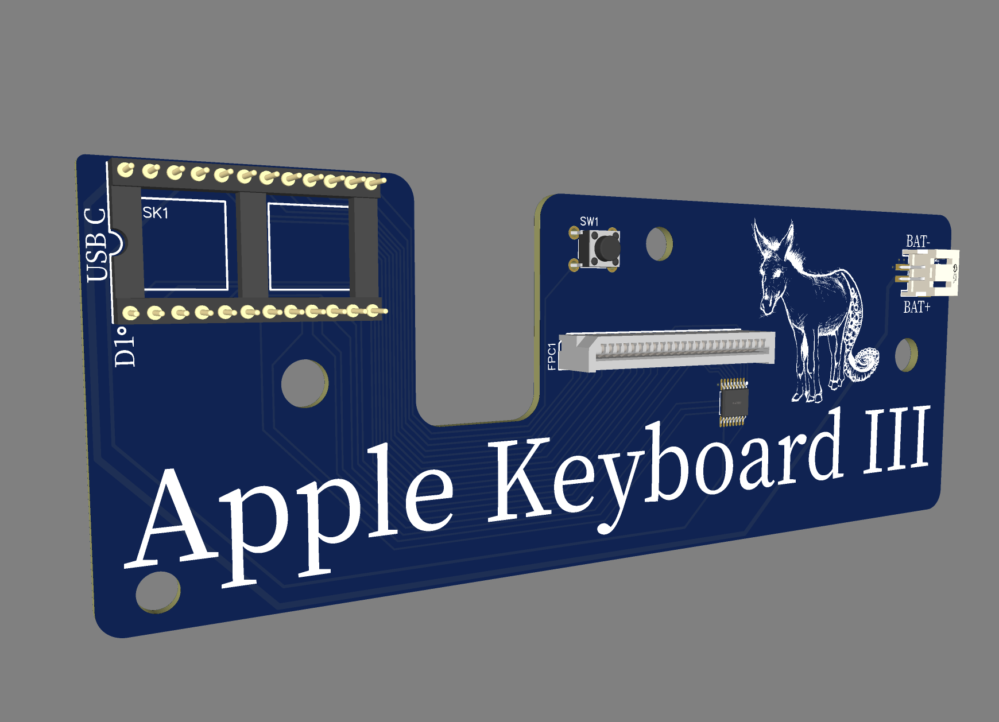

# ZMK firmware for Apple Keyboard II.

For most mechanical keyboard enthusiasts, the Apple Keyboard II is probably one of the most hated products ever made. It's rubber dome switches are known for their mushy-ness. It's a nostalgic keyboard for me though, and I wanted to bring some attention to it and modernize it a little bit.

As I worked into this project, it seemed to make sense to build a new pcb that could connect to the flat cable from the original keyboard membrane.

This repo houses the firmware for the project. You can find it under [releases](https://github.com/willpuckett/zmk-config-ak3/releases/latest). 

The pcb is [available on OSH lab](https://oshwlab.com/willpuckett/akiii).

