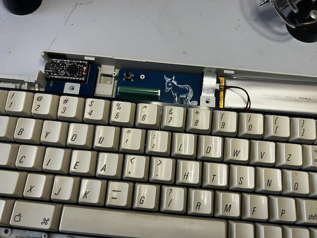
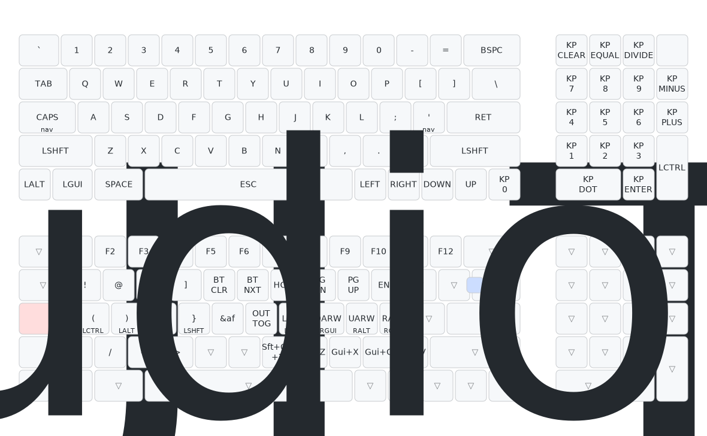
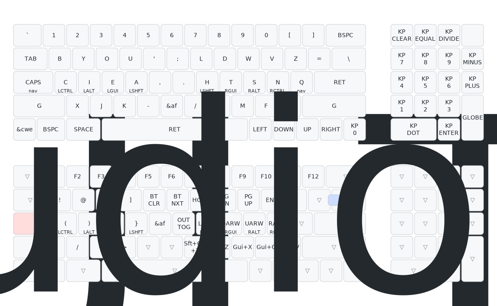

# ak3

[](https://github.com/willpuckett/zmk-config-ak3/actions/workflows/build.yml)



For most keyboard enthusiasts, the [Apple Keyboard II](https://deskthority.net/wiki/Apple_Keyboard_II) is probably one of the most hated products ever made. It's rubber dome switches are known for their mushy-ness. It's a nostalgic keyboard for me though, and I wanted to bring some attention to it and modernize it a little bit.

As I worked into this project, it seemed to make sense to build a new pcb that could connect to the flat cable from the original keyboard membrane.

ak3 is diodeless, expect to find a few 👻!

## Fabrication

The pcb fabrication files are available in the [pcb directory](https://github.com/willpuckett/zmk-config-ak3/tree/main/pcb) of this repository. There are also a couple of extras from my [first run](https://octule.com/) available.

## Layout

Download the [latest builds](https://github.com/willpuckett/zmk-config-ak3/releases/latest).

*ak3* includes support for [zmk studio](https://zmk.studio). The *studio unlock* button is a two key combo on the nav layer, indicated in the below keymaps.


<details>

<summary>

### qwerty

</summary>



</details>

<details>
<summary>

### Engrammer

</summary>


</details>

<details>
<summary>

### Engrammer Shifted

</summary>



</details>

## Installation

1. To install, solder up your Nice!Nano. [Mill-max pins](https://www.digikey.com/en/products/detail/mill-max-manufacturing-corp/3320-0-00-15-00-00-03-0/4147392) work better than diode legs, which tend to not want to come out of the socket very well.
2. Socket the Nice!Nano.
3. Open the case on the keyboard—three screws on the under side, and three screws inside above the keys.


4. Slide the fitting for the flat flexible cable up, and lift the flat membrane cable out of the socket (it's labeled 5597).
5. Remove the old pcb.
6. You might want to take some time to [clean the keyboard innards](https://youtu.be/lRqwCtn7opA?feature=shared&t=288) if it's not looking fresh in there. Compressed air, 90% rubbing alcohol on the membrane if it needs it...
7. Tilt the AK3 pcb a little toward the back. The nice nano will just fit under a nub on the back left wall, and allow it to drop onto the pegs.


8. Pressure fit the flat membrane cable into the new socket. It doesn't slide down to lock like the original one, you just have to press the flat cable in. It's tight when it's new! Press hard-ish without bending the cable. You might have to do it twice. Also, if the contacts don't look too fresh on the membrane cable, you can wipe it down with a q-tip and some 90% rubbing alcohol, allowing it to dry thoroughly before installing in its header.
9. Connect your battery to the battery terminal. 3.7V 3700mAh 103395 Lipo seems to fit pretty well and is large enough to last basically forever. __MAKE SURE THE POLARITY IS CORRECT BEFORE INSERTING__. There is __no__ reverse polarity protection, and __no__ power switch. Use the multi-meter to check the polarity, and flip the wires in the JST-PH fitting if needed. If you've selected a large battery, you'll also probably want to jumper the pads on the back of the Nice!Nano to up the charging current.
10. Using a thermal tape or some bubble gum (not included), attach the battery inside the case so it doesn't flop around when you type really hard.
11. Reinstall the three screws from above the keys.
12. Reinstall the upper bezel, working from the top of the keyboard down.
13. Reinstall the three screws from under the keyboard.


## Module

This repository is configured as a ZMK module (I think). You should be able to add it to ZMK's `config/build.yaml` something like:

```yaml
manifest:
  remotes:
    - name: zmkfirmware
      url-base: https://github.com/zmkfirmware
    # Additional modules containing boards/shields/custom code can be listed here as well
    # See https://docs.zephyrproject.org/3.2.0/develop/west/manifest.html#projects
    - name: willpuckett
      url-base: https://github.com/willpuckett
  projects:
    - name: zmk
      remote: zmkfirmware
      revision: main
      import: app/west.yml
    - name: zmk-config-ak3
      remote: willpuckett
      revision: main
  self:
    path: config
```

Doing this will allow you to use the 'ak3' shield without having to clone in the whole repo, and keep it up to date if it changes upstream (here). 

## Schematic


